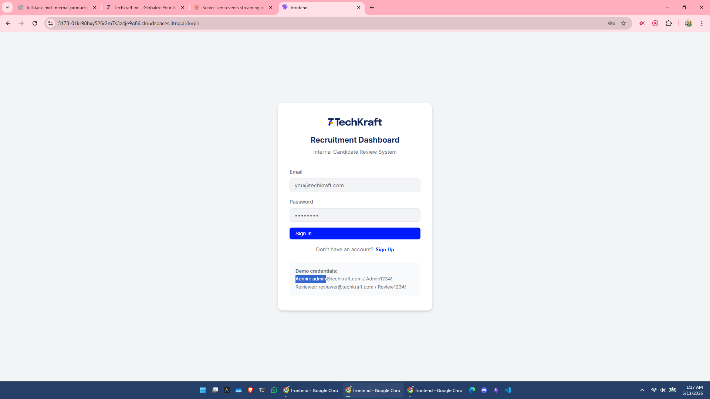
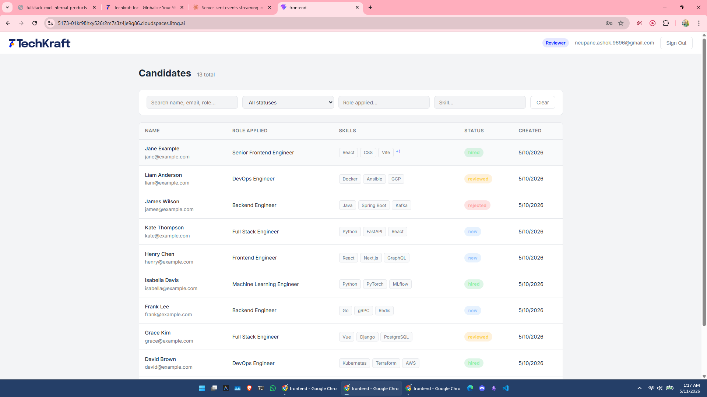
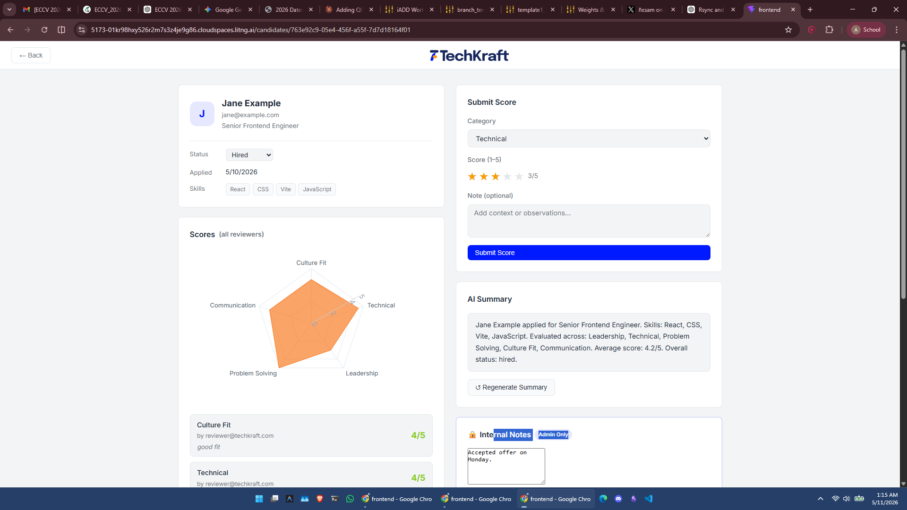

# TechKraft Recruitment Dashboard
Youtube Demo link: https://youtu.be/qELKw-rRXOg
<div align="center">
  <a href="https://youtu.be/qELKw-rRXOg" target="_blank">
    
  </a>
  &nbsp;&nbsp;
  
  
  
</div>

<br/>

Internal candidate scoring and review dashboard for TechKraft's recruitment workflow.


---

## Application Preview

| Login & Registration | Admin Dashboard (Candidate List) | Candidate Detail & Scoring |
|:---:|:---:|:---:|
|  |  |  |

---

## Quick Start

*(**Prerequisites:** You must have **Docker** and **Docker Compose** installed on your system. This project was developed in Linux, but runs seamlessly cross-platform via Docker.)*

### Option A — Docker Compose (recommended)

```bash
# 1. Clone and enter the project
git clone https://github.com/thenaivekid/Recruitment-app.git
cd Recruitment-app

# 2. Create your .env from the example
cp .env.example .env
# Edit .env and set a strong SECRET_KEY

# 3. Build and start
docker compose up --build

# Backend:  http://localhost:8000
# Frontend: http://localhost:5173
# API Docs: http://localhost:8000/docs
```

### Option B — Local Development

**Backend:**
```bash
cd backend
python -m venv venv && source venv/bin/activate
pip install -r requirements.txt
cp ../.env.example .env   # edit as needed
uvicorn app.main:app --reload --port 8000
```

**Frontend:**
```bash
cd frontend
npm install
npm run dev   # http://localhost:5173
```

### Demo Credentials (seeded on first run)

| Role     | Email                        | Password      |
|----------|------------------------------|---------------|
| Admin    | admin@techkraft.com          | Admin1234!    |
| Reviewer | reviewer@techkraft.com       | Review1234!   |

---

## Example API Calls

### ⚡ Interactive API Testing (Recommended)
This repository includes a fully configured `rest.http` file at the root. If you use VS Code, simply install the **[REST Client extension](https://marketplace.visualstudio.com/items?itemName=humao.rest-client)**. 

You can open `rest.http` and click the native **"Send Request"** buttons above each block. This allows you to instantly test everything from JWT authentication and role-based access control, to Candidate CRUD operations and the SSE real-time streaming endpoint natively inside your editor context.

### 💻 Using standard cURL
```bash
BASE=http://localhost:8000

# 1. Login to get your JWT access token
TOKEN=$(curl -s -X POST $BASE/auth/login \
  -H "Content-Type: application/json" \
  -d '{"email":"admin@techkraft.com","password":"Admin1234!"}' \
  | python3 -c "import sys,json; print(json.load(sys.stdin)['access_token'])")

# List candidates (with filters and pagination)
curl "$BASE/candidates?status=new&skill=Python&limit=5&offset=0" \
  -H "Authorization: Bearer $TOKEN"

# Get a candidate's detail (replace <ID>)
curl $BASE/candidates/<ID> -H "Authorization: Bearer $TOKEN"

# Submit a score
curl -X POST $BASE/candidates/<ID>/scores \
  -H "Authorization: Bearer $TOKEN" \
  -H "Content-Type: application/json" \
  -d '{"category":"Technical","score":4,"note":"Strong async patterns"}'

# Trigger AI summary (2s mock delay)
curl -X POST $BASE/candidates/<ID>/summary \
  -H "Authorization: Bearer $TOKEN"

# Admin: update internal notes or status
curl -X PATCH $BASE/candidates/<ID> \
  -H "Authorization: Bearer $TOKEN" \
  -H "Content-Type: application/json" \
  -d '{"internal_notes":"Strong culture fit","status":"reviewed"}'

# Soft delete (archive) — never hard-deletes
curl -X PATCH $BASE/candidates/<ID> \
  -H "Authorization: Bearer $TOKEN" \
  -H "Content-Type: application/json" \
  -d '{"status":"archived"}'

# SSE stream (stretch goal) — open in a browser or:
curl -N -H "Authorization: Bearer $TOKEN" $BASE/candidates/<ID>/stream
```

---

## Running Tests

```bash
cd backend
pip install -r requirements.txt
pytest tests/ -v
```

Three test cases:
1. **Create candidate** — admin creates a candidate, verifies fields and 201 status
2. **Reviewer score isolation** — reviewer2 cannot see reviewer1's scores
3. **Admin full access** — admin sees all reviewers' scores for a candidate

---

## Architecture Decision Records (ADR)

### ADR-1: FastAPI over Flask / Django

**Context:** Choose a Python web framework for the API.

**Decision:** FastAPI with `async`/`await` throughout.

**Trade-off:** Requires async awareness. Rejected Flask (no native async, no auto-validation) and Django REST Framework (too heavy for an internal tool, ORM is harder to swap). FastAPI's native Pydantic integration means request validation and OpenAPI docs are free.

---

### ADR-2: SQLite over DynamoDB / PostgreSQL

**Context:** Need a persistent store that starts with zero cloud config for a take-home submission.

**Decision:** SQLite via SQLAlchemy ORM with explicit indexes on `candidates.status`, `candidates.role_applied`, and `scores.candidate_id`.

**Trade-off:** SQLite is not suitable for high-concurrency production writes (single-writer lock). For production I'd use PostgreSQL with the same SQLAlchemy models — only `DATABASE_URL` changes. DynamoDB was considered but would require AWS credentials, adding friction for a local-first submission.

---

### ADR-3: JWT with hardcoded reviewer role on registration

**Context:** The spec requires RBAC but also says "registration must hardcode role to reviewer — never accept role from the client."

**Decision:** The register endpoint ignores any `role` field entirely — it is not even in the `RegisterRequest` schema. Admins are created only via the seed script or direct DB access. The JWT payload includes the role claim so the frontend can conditionally render admin-only UI without extra round-trips.

**Trade-off:** There is no self-service path to become an admin, which is intentional and correct for an internal tool. The risk of privilege escalation via client-side tampering is eliminated.

---

## Debugging Signal — Bug Identification

The provided snippet:

```python
def search_candidates(status, keyword, page, page_size):
    all_candidates = db.execute("SELECT * FROM candidates").fetchall()
    filtered = [c for c in all_candidates if c["status"] == status]
    # ... also filter by keyword in Python ...
    offset = (page - 1) * page_size
    return filtered[offset : offset + page_size]
```

**The bug:** All rows are fetched into memory (`SELECT *`) and filtering is done in Python. This is an **O(N) memory + time problem** — as the candidates table grows (thousands of rows), every request loads the entire table regardless of how many results the caller needs.

**Why it matters at scale:** With 10,000 candidates and 100 concurrent requests, the server allocates ~10,000 × 100 = 1M row objects per second. Python-side filtering also defeats indexes entirely.

**The correct approach:** Push every filter into the SQL `WHERE` clause and rely on the database's indexed scans:

```python
query = db.query(Candidate).filter(Candidate.status == status)
if keyword:
    query = query.filter(Candidate.name.ilike(f"%{keyword}%"))
total = query.count()
return query.offset((page - 1) * page_size).limit(page_size).all()
```

This is exactly how `candidate_service.get_candidates()` is implemented in this project.

---

## Learning Reflection

Building the SSE stream endpoint and understanding how FastAPI's `StreamingResponse` interacts with `asyncio.sleep` was new territory. It required keeping the DB session alive across an async generator, which taught me to be careful about session scope boundaries in async FastAPI handlers. Given more time, I would replace the mock AI summary with a real streaming LLM call (OpenAI `stream=True`) piped directly into the SSE endpoint, so the user sees tokens appear progressively rather than waiting for the full response.

---

## Project Structure

The repository follows an enterprise-standard Domain-Driven Design layout for FastAPI and React, fully segregating routing, business logic, validation schemas, and database dependencies.

```text
📦 TechKraft Recruitment Application
├── 📂 .github/workflows/      # Automated CI/CD pipeline (Pytest integrations)
├── 📂 assets/                 # UI screenshots for README portfolio
├── 📂 backend/                # FastAPI Microservice
│   ├── 📂 app/                # Application root
│   │   ├── 📂 routers/        # API endpoints (Controllers)
│   │   │   ├── 📄 auth.py
│   │   │   └── 📄 candidates.py
│   │   ├── 📂 services/       # Core business logic layer
│   │   │   └── 📄 candidate_service.py
│   │   ├── 📄 auth.py         # JWT security and password hashing utilities
│   │   ├── 📄 config.py       # Pydantic Settings & Env validation
│   │   ├── 📄 database.py     # SQLite engine and session factory
│   │   ├── 📄 main.py         # App entrypoint, Global Handlers, Seed script
│   │   ├── 📄 models.py       # SQLAlchemy ORM definitions
│   │   └── 📄 schemas.py      # Pydantic V2 Request/Response validation payloads
│   ├── 📂 tests/              # Pytest suite
│   │   └── 📄 test_api.py     # Endpoint and strict RBAC security tests
│   ├── 🐳 Dockerfile          # Multi-stage production container
│   └── 📄 requirements.txt    # Python dependencies
├── 📂 frontend/               # React + Vite Client
│   ├── 📂 src/                
│   │   ├── 📂 api/            # Axios client, interceptors, services
│   │   ├── 📂 context/        # Global React Contexts (Auth)
│   │   ├── 📂 pages/          # View-level React Components
│   │   ├── 📄 App.jsx         # React Router and Private Route logic
│   │   ├── 📄 index.css       # Global design system & typography variables
│   │   └── 📄 main.jsx        # Root injector & TanStack Query Provider
│   ├── 🐳 Dockerfile          # Nginx static host container
│   ├── ⚙️ nginx.conf          # Nginx proxy config bypassing CORS
│   ├── 📄 package.json        
│   └── ⚙️ vite.config.js      # Vite build & local proxy settings
├── 📄 docker-compose.yml      # Multi-container orchestration (Backend + Frontend)
├── 📄 rest.http               # Interactive VS Code API testing client
├── 📄 examples.sh             # Executable shell script for cURL examples
└── 📄 .env.example            # Template for required environment variables
```

---

## Security Notes

- Credentials are **never** committed. Use `.env.example` as a template.
- `role` is never accepted from the client at registration.
- All candidate deletions are **soft deletes** (`status=archived`, `deleted_at` set) — no hard deletes.
- JWT tokens expire after 8 hours.
- Reviewers cannot read `internal_notes` or other reviewers' scores — enforced server-side, not just in the UI.
